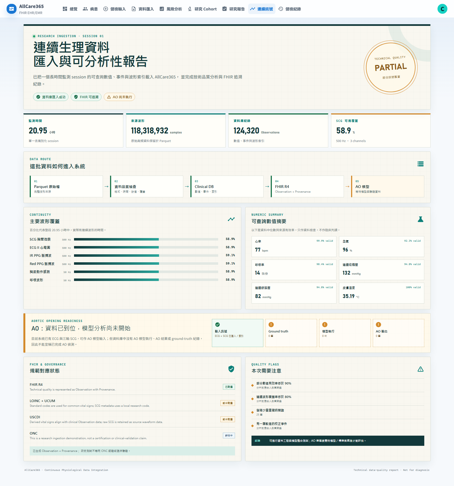

# Sotera 連續生理資料試載入—教授版簡報告

## 一句話結論

已成功將一個約 21 小時的連續生理監測 session 載入 AllCare365，並在系統中看到資料量、生命徵象摘要、訊號覆蓋率及 FHIR 追溯結果；目前可以進行資料工程與模型整合測試，但尚未收到或執行 AO 模型，因此不能回報 AO 偵測準確度。

## 建議附圖

## 可直接寄出的 email

主旨：連續生理資料試載入與初步分析結果

教授您好，

我們已先使用目前可取得的 pilot data 中一個 session，測試載入 AllCare365 系統。

測試結果如下：

- 成功載入約 20.95 小時的監測資料。
- 系統資料庫建立 124,320 筆可查詢紀錄，包含生命徵象、事件及波形索引。
- 原始資料共有約 1.18 億個波形 samples；因資料量很大，原始波形保留在 Parquet 檔，資料庫保存可查詢的數值、索引及分析結果。
- 心率、血氧、呼吸率及連續血壓等數值可以正常統計；SCG、ECG、PPG 等主要波形的實際覆蓋率約為 59%，因此目前品質判定為「可分析，但有部分時間缺少波形」。
- 技術品質結果已建立 FHIR Observation 及 Provenance，保留資料來源與分析方法。

目前資料中可以確認有 ECG 與三軸 SCG，可供後續 AO 模型使用；但本次資料庫中尚未看到 AO ground-truth、AO 模型執行紀錄或 AO 輸出。因此這次完成的是「資料載入及可分析性測試」，尚不是 AO 模型準確度驗證。

想再向資料提供方確認：AO 模型或 AO 標註資料是否會另外提供？目前信件提到約 300 sessions，但現階段下載位置可看到的是 2 個 pilot sessions，後續完整資料的提供方式也需要再確認。

附件為系統中的分析畫面，供您參考。

敬上

## 給內部人員的用語備註

- USCDI 是標準化的健康資料類別與資料元素集合，不是資料庫軟體。對教授可簡稱「在我們的 USCDI／FHIR 架構下完成試載入」。
- AO ground truth 是用來確認正確答案的參考標註；AI model 是根據輸入訊號產生 AO 預測的演算法。兩者用途不同，也可能由不同單位提供。
- 本次常見生命徵象已保存 LOINC／UCUM 對應；SCG 原始波形不是一般 USCDI 核心生命徵象，需透過研究用編碼、來源檔與 FHIR Provenance 保留其意義。
- 本次成果是技術資料品質分析，不是疾病診斷、AO 臨床驗證或 ONC 認證聲明。

## 可重現證據

- Session duration：20.951 小時。
- Source numeric rows：129,534。
- Imported database observations：124,320。
- Raw waveform samples：118,318,932。
- SCG：500 Hz、3 channels、覆蓋率 58.88%。
- Quality findings：部分數值有效率低於 90%、波形覆蓋率低於 80%、25 個重複時間戳、1 個 poor calibration event。
- FHIR derived records：Observation + Provenance。
- AO model runs / outputs / ground-truth records：0 / 0 / 0。

官方定義參考：[USCDI](https://isp.healthit.gov/united-states-core-data-interoperability-uscdi)、[FHIR R4 Observation](https://hl7.org/fhir/R4/observation.html)、[ONC §170.315(g)(10)](https://healthit.gov/test-method/standardized-api-for-patient-and-population-services-acb-atl/)。
