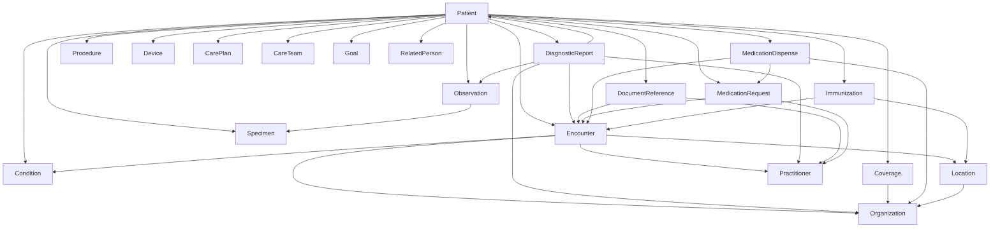

# US Core STU7 Semantic Projection Architecture

This document defines the architecture contract before projector implementation changes.

Flow:

1. US Core Graph Design
2. Golden Patient Design
3. Relational Seed Design
4. Projector Design
5. Inferno Validation

## 1) US Core Resource Dependency Graph

Design principle: graph is based on Must Support reference dependencies (not optional references).

Machine-readable dependency artifacts:

- `docs/uscore_stu7_artifacts/reference_edges_agg.json`
- `docs/uscore_stu7_artifacts/reference_edges_raw.json`

## 2) Golden Patient Canonical Dataset

Golden Patient = a single patient graph that covers:

- all US Core STU7 profiles in Inferno single-patient scope
- all Must Support reference chains
- all required SHALL searches and core SHOULD searches used by Inferno
- all Must Support element paths across profiles

Canonical relational dataset (minimum target counts):

- `Patient`: 1
- `HealthScreening`: >= 2 (active + resolved encounter context)
- `Problem`: >= 3 (active concern + resolved encounter diagnosis + screening-assessment slice coverage)
- `VitalSigns`: >= 1
- `LaboratoryResults`: >= 3 (numeric + codeable + string value patterns)
- `HealthStatusAssessment`: >= 1
- `ClinicalTestResult`: >= 1
- `PatientDocument`: >= 2 (different note types/dates)
- `PatientMedication`: >= 2 (request/dispense variation)
- `Immunization`: >= 1
- `Procedure`: >= 1
- `MedicalOrder`: >= 1
- `InsuranceData`: >= 1
- `MedicalDevice`: >= 1
- `CarePlan`: >= 1
- `CareTeamMember`: >= 1
- `AdvanceDirective`: >= 1
- `PatientAllergy`: >= 1

Reference anchor constants (projector-time singleton resources):

- `Organization/bulk-organization-1`
- `Practitioner/example-practitioner`
- `Location/bulk-location-1`
- `Media/media-example-1`

## 3) Must Support Catalog (ALL Profiles)

Complete extracted Must Support lists for all STU7 generated profile groups are stored in:

- `docs/uscore_stu7_artifacts/must_support_catalog.md`
- `docs/uscore_stu7_artifacts/must_support_catalog.json`

Extraction source:

- `tmp_us_core_test_kit/lib/us_core_test_kit/generated/v7.0.0/*/metadata.yml`

## 4) Relational -> FHIR Mapping Tables

Mapping policy:

- Relational DB stores clinical truth only.
- FHIR semantics and terminology are projector-only.
- No FHIR JSON persisted.
- Terminology assignment (LOINC/SNOMED/RxNorm/UCUM) is done by TerminologyService in projectors.

Canonical mapping matrix:

| FHIR resource/profile family | Primary relational source | Reference join source | Must Support strategy |
|---|---|---|---|
| Patient (`us-core-patient`) | `patients.Patient` | N/A | demographic + communication + required old-name/old-address slices |
| Condition (problems + encounter diagnosis) | `health_screening.Problem` | `health_screening.HealthScreening` | profile split by resolved/encounter context; asserted/onset/recorded/abatement coverage |
| Encounter | `health_screening.HealthScreening` | `patients.Patient.problems` | participant/location/serviceProvider/reasonReference/diagnosis coverage |
| Observation (all observation profiles) | `VitalSigns`, `LaboratoryResults`, `HealthStatusAssessment`, `ClinicalTestResult` | `HealthScreening`, `Specimen` | category/code profile routing; value[x] coverage; encounter/specimen/interpretation |
| DiagnosticReport (lab + note) | `LaboratoryResults`, `PatientDocument` | `Observation`, `Encounter`, `Practitioner` | category slice routing; performer/result/media/presentedForm |
| DocumentReference | `PatientDocument` | `Encounter`, `Practitioner` | identifier/content/context/author/period/relatesTo |
| MedicationRequest | `PatientMedication` | `Encounter`, `Practitioner`, `Medication` | intent/status/requester/encounter/dosage/dispenseRequest |
| MedicationDispense | `PatientMedication` | `Encounter`, `Organization`, `MedicationRequest` | context/performer/authorizingPrescription/quantity/dosage |
| Immunization | `health_screening.Immunization` | `Encounter`, `Location` | status/statusReason/encounter/occurrence/primarySource |
| Procedure | `health_screening.Procedure` | `Encounter` | status/code/subject/performed/encounter |
| ServiceRequest | `patients.MedicalOrder` | `Encounter`, `Practitioner` | status/intent/category/code/requester |
| Coverage | `patients.InsuranceData` | `Organization` | member id slice + class slices + payor + period + costToBeneficiary |
| Device | `patients.MedicalDevice` | `Patient` | UDI and must-support implantable fields |
| CarePlan | `patients.CarePlan` | `Patient` | category/status/intent/subject/text |
| CareTeam | `patients.CareTeamMember` | `Practitioner/PractitionerRole/RelatedPerson` | participant/member/role/status |
| Goal | `patients.AdvanceDirective` | `Patient` | lifecycle/description/subject/target |
| AllergyIntolerance | `patients.PatientAllergy` | `Patient` | clinical/verification/code/patient/reaction |
| Specimen | `health_screening.LaboratoryResults` | `Patient` | subject/type/collection |
| Location | projector singleton | `Organization` | managingOrganization + address profile |
| Organization | projector singleton | N/A | identifier/name/address/telecom |
| Practitioner / PractitionerRole | projector singleton | Organization + Location | identifier/name/telecom and role links |
| RelatedPerson | `patients.Patient` relation fields | `Patient` | patient/relationship/name |
| Provenance | derived from projected resource | Organization | target + author/time semantics |

## 5) Required Inter-Resource References Contract

Must Support references that must be resolvable in Inferno:

- `Condition.subject -> Patient`
- `Condition.encounter -> Encounter`
- `Encounter.participant.individual -> Practitioner`
- `Encounter.reasonReference -> Condition`
- `Encounter.location.location -> Location`
- `Encounter.serviceProvider -> Organization`
- `DiagnosticReport.subject -> Patient`
- `DiagnosticReport.encounter -> Encounter`
- `DiagnosticReport.performer -> Practitioner` (and optionally Organization)
- `DiagnosticReport.result -> Observation`
- `DiagnosticReport.media.link -> Media`
- `DocumentReference.subject -> Patient`
- `DocumentReference.author -> Practitioner`
- `DocumentReference.context.encounter -> Encounter`
- `Coverage.beneficiary -> Patient`
- `Coverage.payor -> Organization`
- `MedicationRequest.subject -> Patient`
- `MedicationRequest.encounter -> Encounter`
- `MedicationRequest.requester -> Practitioner`
- `MedicationDispense.subject -> Patient`
- `MedicationDispense.context -> Encounter`
- `MedicationDispense.performer.actor -> Organization`
- `MedicationDispense.authorizingPrescription -> MedicationRequest`
- `Observation.subject -> Patient`
- `Observation.encounter -> Encounter`
- `Observation.specimen -> Specimen`
- `Immunization.patient -> Patient`
- `Immunization.encounter -> Encounter`
- `Immunization.location -> Location`

## 6) Search Contract (Inferno-facing)

Complete extracted search combinations are in:

- `docs/uscore_stu7_artifacts/search_catalog.json`

Implementation rule:

- `SHALL` search combinations must return at least one matching resource for Golden Patient.
- `SHOULD` combinations used by Inferno groups should be enabled for stability.

## 7) Approval Gate Before Projector Changes

Architecture is approved when:

1. Golden Patient dataset cardinalities are approved.
2. Must Support catalog is accepted as source of truth.
3. Dependency graph and reference contract are accepted.
4. Search contract (`SHALL` + selected `SHOULD`) is accepted.

Only then do we implement/adjust projectors.

